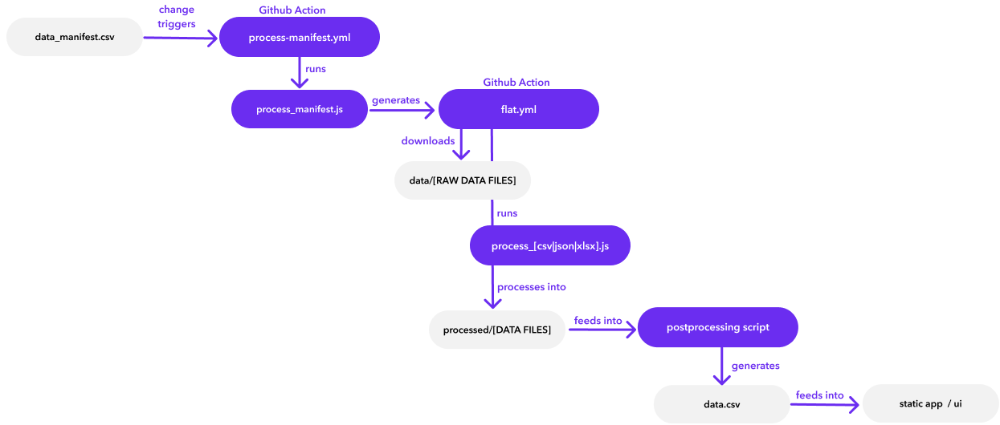

# Data manifest instructions

To get data into the app, it needs to go through a few steps:

- `data_manifest.csv` describes where we want to download data from.
- When the contents of `data_manifest.csv` update, the Github Action `process-manifest.yml` runs, kicking off `process_manifest.js` which generates the `flat.yml` file
- When `flat.yml` is updated, the Github Action runs, which downloads raw data for each row in the manifest and saves that in the `data/` folder. Then the Action processes each `data/` file using the `process_*.js` scripts (depending on the format of the data, described in `data_manifest.csv`) and spits out processed `csv` files into the `processed/` folder. Once the workflow is build, this Github Action will run once every month, to keep all of the data updated.
- There will be a postprocessing script that converts the processed data from `processed/` into a single `data.csv` file
- When `data.csv` updates, the static app/ui will re-build, showing the most recent data in the end web app.

# Right, so how do I fill out the `data_manifest.csv` file

First, we need to describe where we want the data from, and how to process it. That's where the `data_manifest.csv` comes in!

Each row in the `data_manifest.csv` file will download data from a single url. Ideally, there should be one data file per row. This not only ensures that the GitHub action works more quickly (by only fetching a data file once), but also affords us full flexibility to slice and dice the ingested and processed data later on.

Let's look at a few example rows:

| name                             	| format 	| endpoint                                                                                   	| Excel sheet # 	| Excel sheet top row # 	| Country Column # 	| Year Column # 	|
|----------------------------------	|--------	|--------------------------------------------------------------------------------------------	|---------------	|-----------------------	|------------------	|---------------	|
| countries_ixp                    	| csv    	| https://www.pch.net/ixp/dir_data_csv                                                       	|               	|                       	|                  	|               	|
| countries_mobile_connectivity    	| xlsx   	| https://www.mobileconnectivityindex.com/widgets/connectivityIndex/excel/MCI_Data_2020.xlsx 	| 3             	| 3                     	|                  	|               	|

For example, `processed/countries_ixp.csv` will be downloaded from https://www.pch.net/ixp/dir_data_csv

A more complex example: `data/countries_mobile_connectivity.xlsx` will be downloaded from https://www.mobileconnectivityindex.com/widgets/connectivityIndex/excel/MCI_Data_2020.xlsx, then the `process_xlsx.js` script will extract data from the 3rd sheet of the Excel file. The top two rows of the sheet are just instructions, so **Excel sheet top row #** is set to `3`, to make sure our script knows where the data lives. The processed data will be generated at `processed/countries_mobile_connectivity.csv`.

Some quick notes:

- the **name** of each row should be unique
- make sure you specify the **format** column with the type of data downloaded from the **endpoint** url: `xlsx`, `csv`, or `json`

# Checking the output

While you save the `data_manifest.csv` file, the `process-manifest` Github Action will be triggered, which will generate and run the `flat` Github Action. This should populate the `processed/` folder with processed data.

https://github.com/undp/digital-readiness-assessment/tree/main/processed

You can check on the Github Action runs here:

https://github.com/undp/digital-readiness-assessment/actions

If something fails, you'll see a red ❌, and you can click in to see what the error message is. If you're still confused why it's failing, you can [open an Issue on Github](https://github.com/undp/digital-readiness-assessment/issues/new) to flag that you need help.
